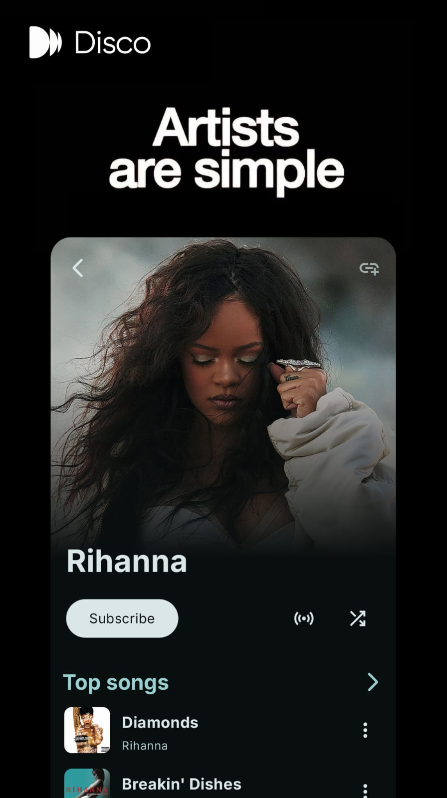
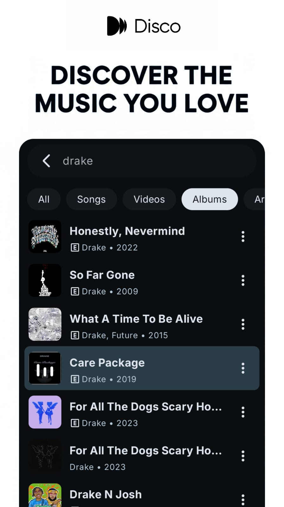
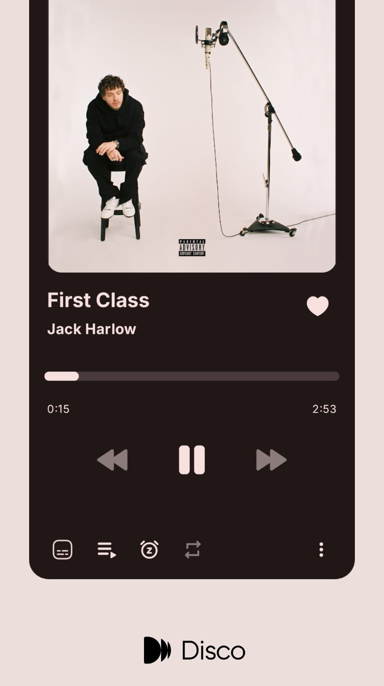
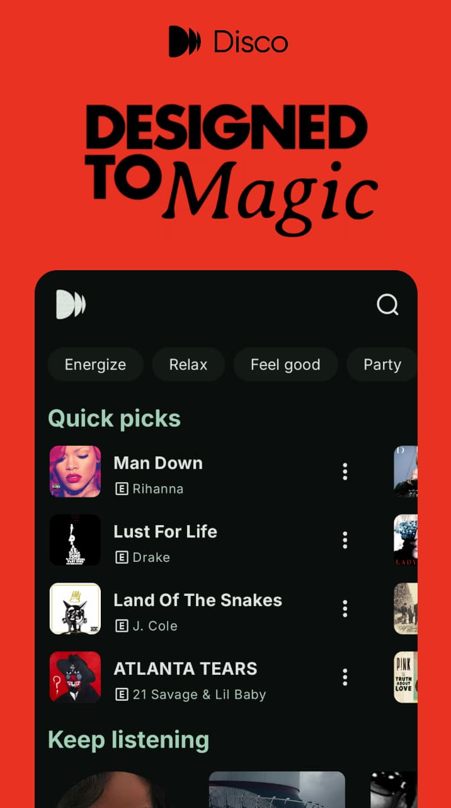
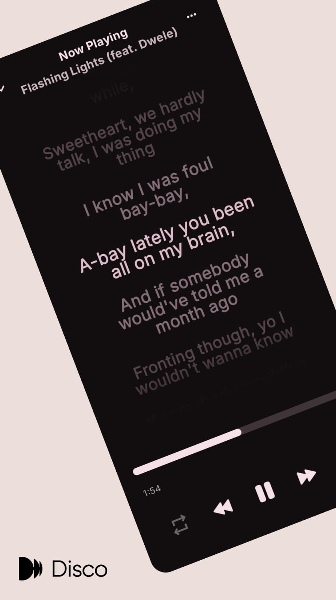

<h1>Disco</h1>

YouTube Music client for Android

<h2 style="margin: 0;"><strong>⚠Warning</strong></h2>
If you're in a region where YouTube Music is not supported, you won't be able to use this app <strong>unless</strong> you have a proxy or VPN to connect to a YTM-supported region.

<h1>Showcase</h1>

<h1>Features</h1>

- Play any song or video from YT Music
- Background playback 
- Personalized quick picks 
- Library management 
- Download and cache songs for offline playback
- Search for songs, albums, artists, videos and playlists
- Live lyrics 
- YouTube Music account login support
- Syncing of songs, artists, albums and playlists, from and to your account
- Skip silence 
- Import playlists 
- Audio normalization 
- Adjust tempo/pitch 
- Local playlist management
- Reorder songs in playlist or queue 
- Light - Dark - black - Dynamic theme
- Sleep timer
- Material 3 
  etc.

<h1>FAQs</h1>

### Q: Why Disco isn't showing in Android Auto?

1. Go to Android Auto's settings and tap multiple times on the version in the bottom to enable
   developer settings
2. In the three dots menu at the top-right of the screen, click "Developer settings"
3. Enable "Unknown sources"

<h1>Development Setup</h1>

### GitHub Secrets Configuration

This project uses GitHub Secrets to securely store API keys for building releases. To set up the secrets:

1. Go to your GitHub repository settings
2. Navigate to **Settings** → **Secrets and variables** → **Actions**
3. Add the following repository secrets:
   - `LASTFM_API_KEY`: Your LastFM API key
   - `LASTFM_SECRET`: Your LastFM secret key

4. Get your LastFM API credentials from: https://www.last.fm/api/account/create

**Note:** These secrets are automatically injected into the build process via GitHub Actions and are not visible in the source code.

This project and its contents are not affiliated with, funded, authorized, endorsed by, or in any way associated with YouTube, Google LLC or any of its affiliates and subsidiaries.

Any trademark, service mark, trade name, or other intellectual property rights used in this project are owned by the respective owners.

**Made with ❤️ by [Omar](https://github.com/omarkarimli)**
